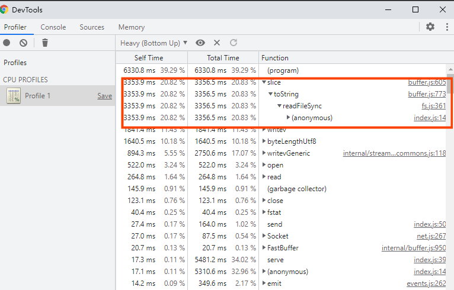
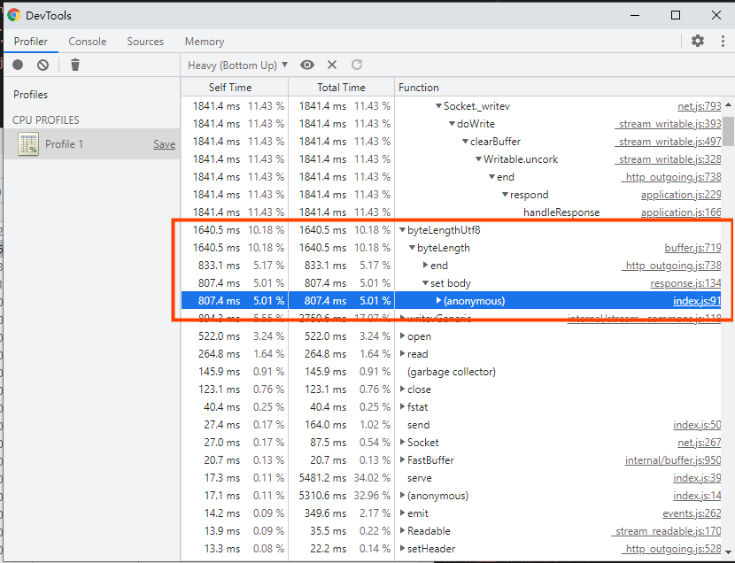

通过

> node --inspect-brk index.js

> chrome://inspect profile分析



查看该位置代码，发现可优化空间。
这个时候的qps是261.95 [#/sec] (mean)
```javascript
const INDEX = fs.readFileSync(__dirname + '/source/index.htm', 'utf-8')
app.use(
    mount('/', async (ctx) => {
        // ctx.body = fs.readFileSync(__dirname + '/source/index.htm', 'utf-8')
        // 1. 不需要每次请求都使用函数加载
        ctx.body = INDEX;
    })
);
```
qps 明显提升
Requests per second:    630.69 [#/sec] (mean)

再看第二张相关的图片

在setBody 的时候调用了byteLengthUtf8()

> fs.readFileSync(path[, options])
如果指定了 encoding 选项，则此函数返回字符串。 否则它返回缓冲区。

修改这里再测试
```javascript
// const INDEX = fs.readFileSync(__dirname + '/source/index.htm', 'utf-8')
const INDEX = fs.readFileSync(__dirname + '/source/index.htm')
app.use(
    mount('/', async (ctx) => {
        // ctx.body = fs.readFileSync(__dirname + '/source/index.htm', 'utf-8')
        // 1. 不需要每次请求都使用函数加载
        ctx.body = INDEX;
    })
);
```

body如果赋值为buffer 需要设type = html,不然会被误以为下载
Requests per second:    4285.26 [#/sec] (mean)


**总结**

1. 空间换时间
2. 减少不必要的计算，提前计算。